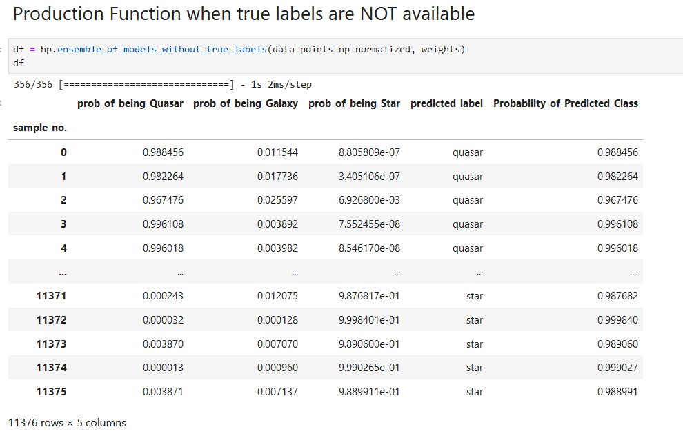
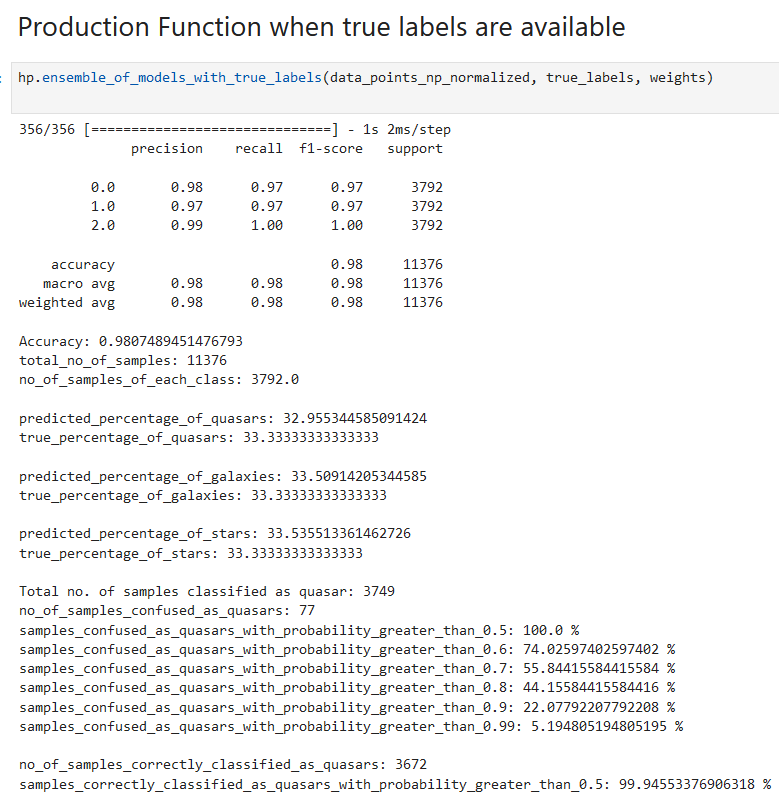
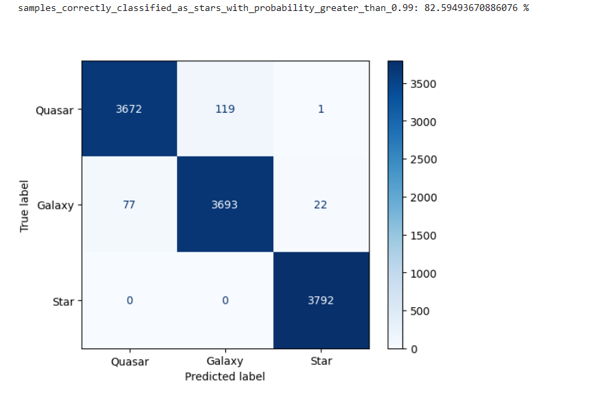

### Skills demonstarted:
(pandas, numpy, tensorflow, scikit-learn, matplotlib, uvicorn, fastapi, docker, amazon_aws_lambda)

# End-to_End Machine Learning Project

## Data Cleaning, Processing and Feature Engineering

## Data Visualization

## Training Machine Learning Models

## Pre-Deployment-Testing

## Deployment on Amazon Aws Lambda Using Docker

## [Project_Report](https://github.com/AnsImran/Classifying-Quasars-Galaxies-Stars-using-Photometry/blob/master/06__Project_Report/Project_Report.pdf) (Detailed)

---

# Project Summary and References
Data Cleaning, Processing and Feature Engineering, Data Visualization and Training Machine Learning Models

_[photometry.ipynb](02__Data_Analysis__Training__Saving_Models/photometry.ipynb)_

Pre-Deployment-Testing

_[comparing_models.ipynb](03__Pre_Deployment/03__pre_production_notebooks/01__comparing_models.ipynb)_

_[pre_production_testing.ipynb](03__Pre_Deployment/03__pre_production_notebooks/02__pre_production_testing.ipynb)_

# Classifying-Quasars-Galaxies-Stars-using-Photometry
### I have tried to classify Quasars, Galaxies and Stars using photometric data.
### Motivations:
Large catalogs of unlabelled stellar objects are available. Labelling these stellar objects is important for a number of reasons. E.g: for statistical poulation analyses and for [testing cosmological models](https://academic.oup.com/mnras/article/444/1/2/1016765) to name a few. Although these stellar objects can be classified by analyzing their optical spectrums but that process is time consuming. [Next generation of telescopes](https://ui.adsabs.harvard.edu/abs/2019ApJ...873..111I/abstract) will increase the quantity of available unlabelled data even more! That's why I have tried to use the photometric data and a combination of machine learning approaches to label the stellar objects.

## [Based on Kaggle Dataset](https://www.kaggle.com/datasets/fedesoriano/stellar-classification-dataset-sdss17)

# Table of Contents [photometry.ipynb](02__Data_Analysis__Training__Saving_Models/photometry.ipynb)

## 1. Data Cleaning & Data Preparation
   - ##### Loading data as a Pandas Data Frame
   - ##### Selecting relevant columns/features
   - ##### Removing unphysical records/rows
   - ##### Undersampling
   - ##### Creating training, validation and test splits
   - ##### Converting data into numpy arrays
   - ##### Normalizing The Data

## 2. Data Visualisation
 - #### Principal Component Analysis
   - ##### Intercative 3d scatter plot

## 3. Data Classification
 - ### Unsupervised Learning
   - ##### Gaussian Mixture Model - Clustering
      - ##### Choosing the best Permutation

 - ### Supervised Learning
   - ##### Neural Network
   - ##### XGBoost
   - ##### Random Forest 

## 4. Model Ensembling
   - ##### Simple-Random-Search for weight optimization

## 5. Conclusions

## 6. What's Next?
   - ##### How can we achieve this?
   - ##### Possible Limitations

### Results
The results were:
- For objects correctly_classified as Quasars, 90.3% of them had a probability greater than 0.9 of being a Quasar.
- For objects correctly_classified as Galaxies, 86.7% of them had a probability greater than 0.9 of being a Galaxy.
- For objects correctly_classified as Stars, 99.6% of them had a probability greater than 0.9 of being a Star.
### Screenshots from the notebook [pre_production_testing.ipynb](03__Pre_Deployment/03__pre_production_notebooks/02__pre_production_testing.ipynb):

### Features Used
| Feature Name   | Description                                                                                                       |
|---------------|-------------------------------------------------------------------------------------------------------------------|
| u             | Ultraviolet filter in the photometric system                                                                   |
| g             | Green filter in the photometric system                                                                        |
| r             | Red filter in the photometric system                                                                          |
| i             | Near Infrared filter in the photometric system                                                                |
| z             | Infrared filter in the photometric system                                                                     |
| redshift      | Redshift value based on the increase in wavelength                                                            |
| class         | Object class (galaxy, star, or quasar object)                                                                 |

